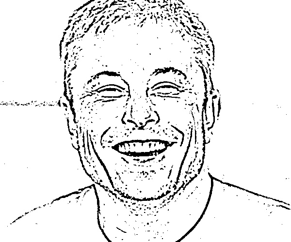
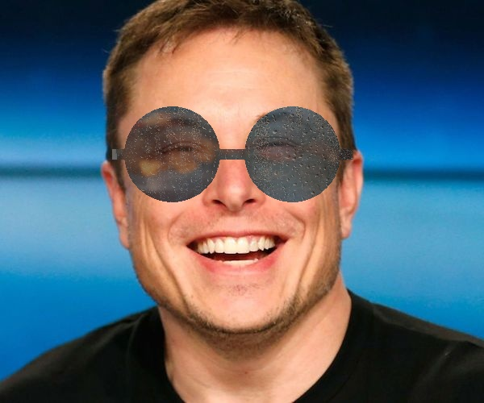
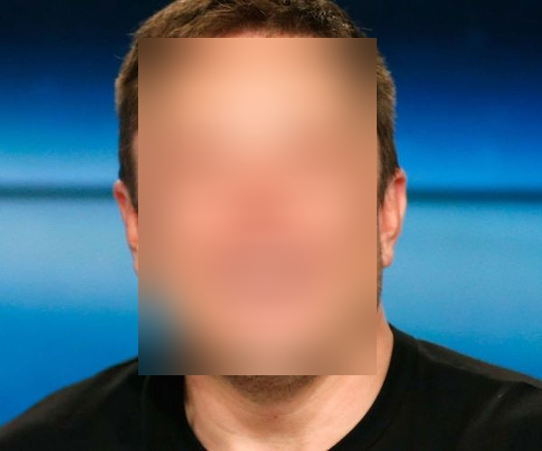
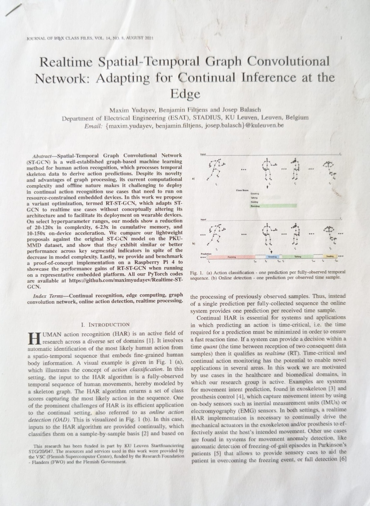

# Custom Useful Utils

A small repository of Python utilities for:
- Computer Vision helpers
- Image-Video Processing helpers 
- GitHub follower/following snapshots and comparison.

## Repository Structure

- `custom_utils.py`
  - Defines `imread_custom()` for robust image loading with OpenCV from file paths containing non-ASCII characters or long Windows paths.

- `CV_IP_Utils/`
  - `cv_classes.py`
    - Contains Computer Vision & Image-Video Processing utilities and classes:
      - `Filters` for cartoon, pencil sketch, skin smoothing, sunglasses overlay, face bluring and image/video display.
      - `Blemish` for blemish removal using seamless cloning or inpainting.
      - `MouseHandler` for OpenCV mouse-based point selection.
      - `DocumentScanner` for document contour detection, perspective correction, and post-processing.
      - `Tracker` for YOLO-based detection and OpenCV tracking.

- `GitHub_Utils/`
  - `followers_check.py`
    - Fetches GitHub followers via the GitHub API and saves usernames to `GitHub_Utils/followers/followersYYYY-MM-DD.json`.
  - `followings_check.py`
    - Fetches GitHub users you are following and saves usernames to `GitHub_Utils/following/followingYYYY-MM-DD.json`.
  - `compare_follow.py`
    - Compares two snapshot JSON files and prints usernames that were added or removed.
  - `followers/` and `following/`
    - Automatically created directories for stored GitHub snapshot files.

## Features

### Image/video utilities
- `imread_custom()` for safer OpenCV image loading from complex file paths.
- Filters for images and video frames:
  - `cartoon`
  - `cartoon_stylized`
  - `pencil`
  - `skin`
  - `sunglasses`
  - `face_blur`
- Blemish removal with seamless clone or inpaint workflows.
- Document scanning with automatic contour detection or manual corner selection.
- YOLO-based ball/object detection with tracker fallback.

### GitHub utilities
- Save followers and following lists as dated JSON snapshots.
- Compare two snapshot files to identify added and removed usernames.
- Supports authenticated API requests via `GITHUB_TOKEN` in a `.env` file.


### Example Filter Results

Here are some example outputs from the various filters applied to sample images:

| Cartoon Filter | Cartoon Stylized Filter |
| --- | --- |
|  |  |

| Pencil Sketch Filter | Skin Smoothing Filter |
| --- | --- |
|  |  |

| Sunglasses Filter | Sunglasses Filter 1 |
| --- | --- |
|  |  |

| Sunglasses Filter 2 | Face Blur Filter |
| --- | --- |
|  |  |

### Example DocumentScanner Results

Here are some example inputs/outputs from `DocumentScanner` class

| Raw Photo | Manual Contour Selection |
| --- | --- |
|  |  |
| Processed Saved PDF | [ View PDF ](CV_IP_Utils/result_pics/scanned-processed_1.pdf) |

| Raw Photo | Contour Detection |
| --- | --- |
|  |  |
| Processed Saved PDF | [ View PDF ](CV_IP_Utils/result_pics/scanned-processed_2.pdf) |


## Usage

### GitHub utilities
1. Create a `.env` file at the repository root.
2. Add your GitHub username and optional token:

```dotenv
GITHUB_USERNAME=your_username
GITHUB_TOKEN=your_token
```

3. Run the GitHub scripts:

```bash
python GitHub_Utils/followers_check.py
python GitHub_Utils/followings_check.py
```

4. Compare two snapshot files:

```bash
python GitHub_Utils/compare_follow.py
```

### Image/video utilities
- Import `imread_custom` from `custom_utils`:

```python
from custom_utils import imread_custom
```

- Use the `Filters` class from `CV_IP_Utils/cv_classes.py`:

```python
from CV_IP_Utils.cv_classes import Filters

filters = Filters(glasses_path=None, reflection_path=None, source='webcam')
filters.start_filters(filter='cartoon')
```

- `source` may be a webcam index, `'webcam'`, a video file path, or an image file path.

- Use `DocumentScanner` class from `CV_IP_Utils/cv_classes.py`:

```
# Initialize the scanner
scanner = DocumentScanner(image_path, manual_selection=False)
    
# Run the detection and transformation
warped = scanner.run_scanner()
    
if warped is not None:
    final_scan = scanner.post_process_denoise(warped)

if output_path.lower().endswith('.pdf'):
    scanner.save_as_pdf(final_scan, output_path)
```

- Use `Tracker` class from `CV_IP_Utils/cv_classes.py`:

```
soccer_tracker = Tracker()
bbox, color = soccer_tracker.detect_and_track(frame, class_id=32)
```
- `class_id` Yolov8s has 80 classes, class_id =32 is a sport_ball. To track another class.
```
tracker = Tracker()
classes = tracker.get_classes()

# track chosen class example
bbox, color = tracker.detect_and_track(frame, class_id=0)
```

## Dependencies

Install the required packages with:

```bash
pip install opencv-python numpy requests python-dotenv ultralytics
```

> `ultralytics` is only required if you use the `Tracker` class in `cv_classes.py` or face_blur filter in `Filters` class.

## Notes

- `custom_utils.py` is a utility module and contains no runnable script logic beyond the helper function.
- GitHub snapshot files are saved under `GitHub_Utils/followers/` and `GitHub_Utils/following/`.
- `cv_classes.py` uses OpenCV display windows (`cv2.imshow`) and needs a GUI-capable environment.
- The current `compare_follow.py` script uses hardcoded sample file names by default; update `old_file` and `new_file` as needed.
